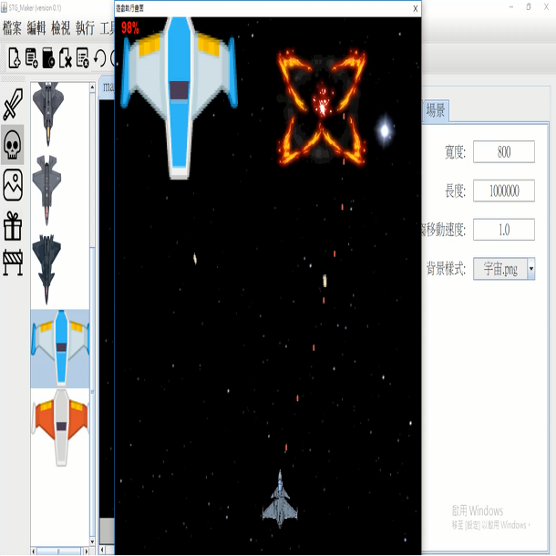
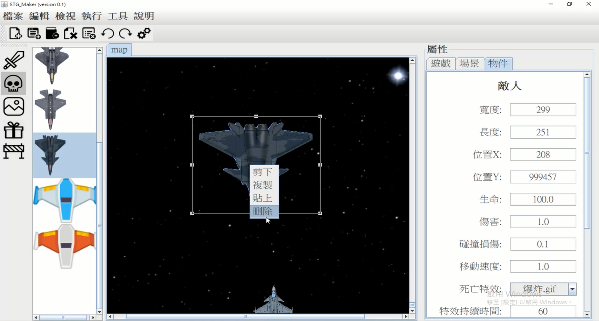

# STG_Maker

STG_Maker is a minimalist game engine designed to enable users without programming knowledge to experience the fun of game design. Primarily aimed at creating side-scrolling shooting games, STG_Maker also allows for creativity in designing other similar games, such as object-dodging and obstacle-avoiding games.

## Getting Started

1. **Watch the Demo Video**: Before using the software, please watch the demo video to understand the usage. The demo video is located at:

   

   
   

2. **Launch the Application**: Start using STG_Maker by opening:
   - `STG_Maker/STG_Maker.jar`

## Adding Assets

You can enhance your game by adding new assets directly into the corresponding folders:

- **background**: Place game background images in the `background` folder.
- **backgroundPanel**: Use the `backgroundPanel` folder for background images.
- **boom**: Store object death effects here (GIFs provide a better visual effect).
- **bullet**: Add bullet images to the `bullet` folder.
- **enemy**: Place enemy object images in the `enemy` folder.
- **music**: Background music files go in the `music` folder.
- **player**: Store player images in the `player` folder.
- **prop**: Add item and supply images to the `prop` folder.
- **sound**: Store shooting sound effects in the `sound` folder.

## Project Management

- **project**: Save and load your game projects using the project folder. Use the top menu in the software for saving and loading.
- **line**: Define enemy movement paths in the `line` folder. Use the right-side property panel -> Game -> Add Path -> Open Drawing Interface within the software to create new paths.

## Features

- **User-Friendly Interface**: No programming skills required. STG_Maker offers a simple interface to help you design your game effortlessly.
- **Customizable Elements**: Easily manage and customize game elements through well-structured asset folders.
- **Dynamic Enemy Paths**: Draw and edit enemy movement paths directly within the application.

## Requirements

- **Java Runtime Environment (JRE)**: Required to run `.jar` files.

---

Enjoy designing your games with STG_Maker! If you encounter any issues or have suggestions for improvements, please feel free to contribute or contact the developers.
